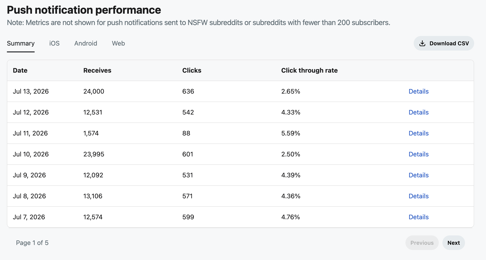
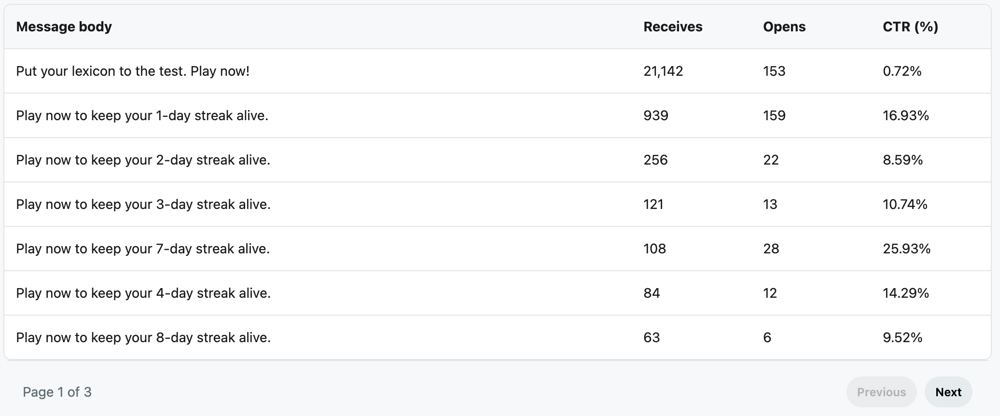
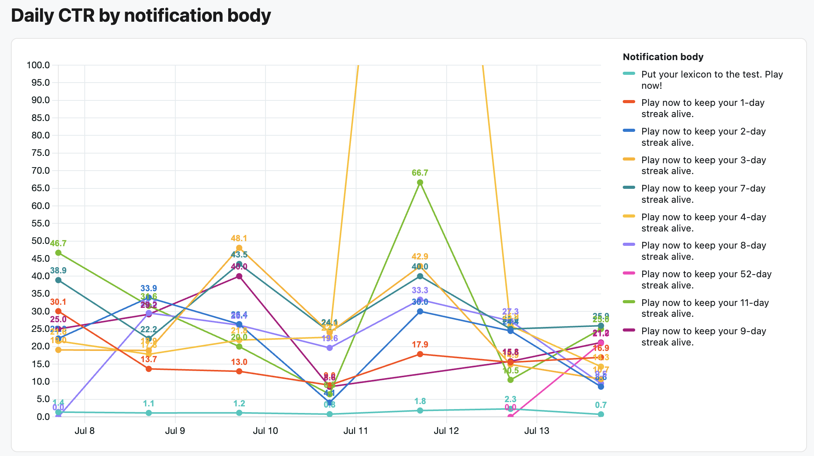

# Push Notifications

Push notification analytics help you understand how frequently users receive notifications from your app and how often those notifications lead to clicks.

You can use these analytics to:

* Track notification delivery and engagement over time.  
* Compare performance across iOS, Android, and Web.  
* Identify notification messages that generate higher click-through rates.  
* Evaluate changes to notification content and strategy.

Note: Push notifications are currently a **gated beta** feature. which means that you’ll need to apply to unlock the ability to use push notifications and track analytics for your app. [Learn how to apply](./docs/capabilities/notifications/notifications-overview#how-to-apply).

## **Push notification performance**

The push notification performance table shows daily delivery and engagement metrics for notifications sent by your app.



Each row represents one day and includes the following metrics:

* **Date:** The date the notifications were received.  
* **Receives:** The number of notifications received.  
* **Clicks:** The number of notifications clicked.  
* **Click-through rate:** The percentage of received notifications that were clicked.

**Note**: Metrics are not shown for push notifications sent to NSFW subreddits or subreddits with fewer than 200 subscribers.

The click-through rate is calculated as:

```
Click-through rate = Clicks ÷ Receives × 100
```

For example, if users received 24,000 notifications and clicked 636 of them, the click-through rate is 2.65%.

### View notification-body details

Select **Details** for a date to view click-through rates grouped by message body. This helps you determine which messages contributed to that day’s performance.



### Download performance data

Select **Download CSV** to export the table data for further analysis or reporting.

**Tip**: When evaluating performance, review click-through rate together with receives and clicks. A high click-through rate based on a small number of receives may not be representative of future performance.

## **Daily CTR by notification body**

The **Daily CTR by notification body** chart compares the click-through rate of the notification messages sent by your app.

Each colored line represents a distinct notification body:

* The horizontal axis shows the date.  
* The vertical axis shows click-through rate as a percentage.  
* Each point shows the CTR for a notification body on a particular date.  
* The legend identifies the notification body represented by each line.



### Analyze notification body performance

Use this chart to:

* Compare notification messages  
* Identify messages with consistently high or low engagement  
* Evaluate changes to wording or calls to action  
* Track how a message performs over multiple days  
* Generate ideas for future notification experiments

Each distinct notification body appears as a separate series. Even small changes to the body text may create a new series.

### Interpret notification-body performance

A higher CTR means that a greater percentage of received notifications resulted in a click. However, a higher CTR does not necessarily indicate a better overall user experience.

When comparing notification bodies, consider:

* The number of notifications received  
* The audience that received each notification  
* When the notification was sent  
* The notification’s purpose and destination  
* Whether the messages were sent under comparable conditions

For meaningful comparisons, keep the audience, timing, destination, and purpose as consistent as possible while testing changes to the notification body, and avoid optimizing only for clicks. 
