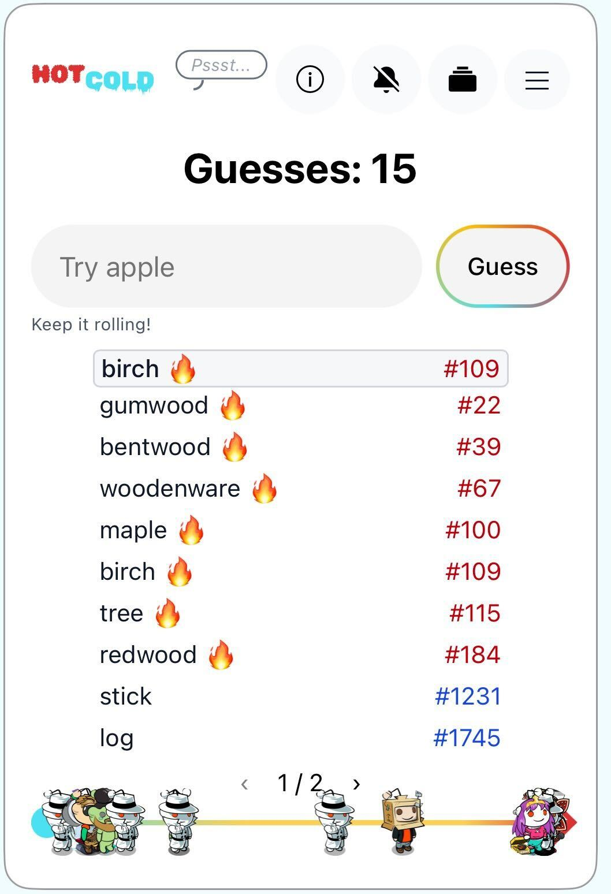
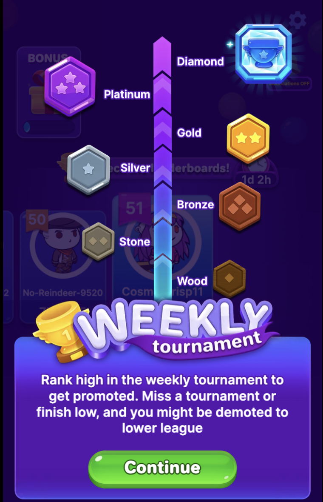
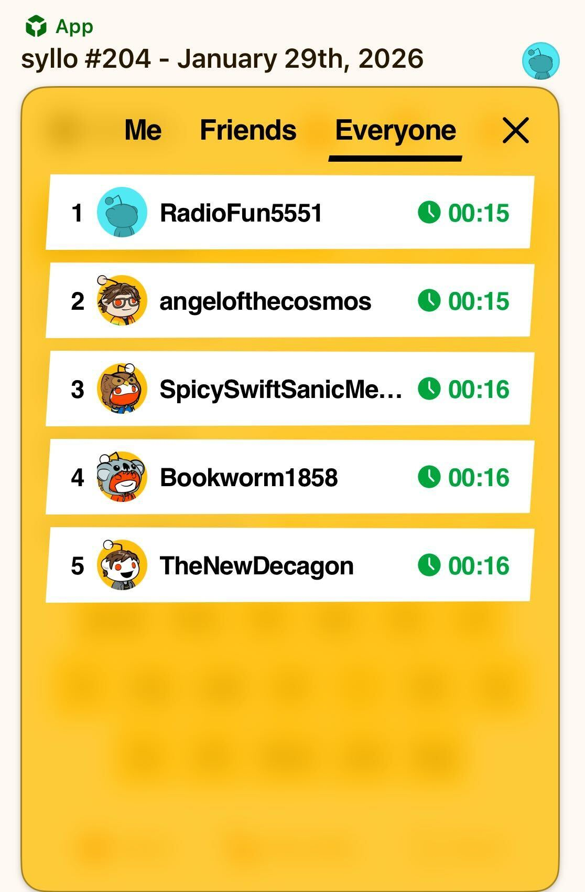
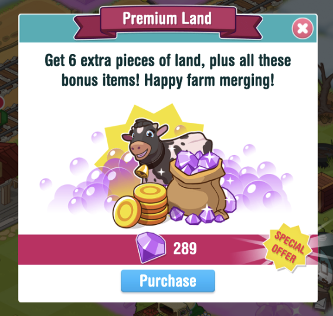

# Building Community Games

Community games are multiplayer experiences that tap into Reddit’s unique social dynamics.

This guide provides practical tips to help you create engaging community games that thrive in Reddit's ecosystem. Read on to learn about the kinds of mechanics that help drive long-term engagement and unlock a shot at [featuring placements](../launch/feature-guide.mdx) for your app.

## Two tests before you build

Before you write code, check your concept against two questions. If either answer is no, change the concept rather than trying to patch it later with retention features.

**Does it get better as more people play?** A good Reddit game is playable with two people and much more fun with a thousand. The [core design principles](#core-design-principles) below call this scaling from one to many, and the steepness of that curve matters as much as its direction. If a thousand players only add rows to a leaderboard, the concept is not there yet.

**Can it be played 100 days in a row?** Streaks, leagues, and notifications reinforce a loop that already works. They cannot rescue one that becomes a chore by day ten.

Two concepts pass a quick review and still fail both tests:

- **Parallel play.** If a session leaves no trace in shared state, players are playing next to the community instead of with it. Make each session change something everyone can see: a play count, a running total, a shifted average, a ghost of a previous run, or a mark left on a shared board.
- **Straight ports.** Relaunching an existing single-player game on Reddit rarely works on its own. The community needs something to do, not just something to watch.

## Player retention

Retention is the art of giving players a reason to come back tomorrow. Most successful games create simple, repeatable patterns that become part of the player’s daily routine.

### Add a subscribe option

One of the simplest ways to drive repeat play is to encourage users to subscribe to your subreddit. Subscribers will see new app posts and community discussions in their home feed, which organically brings them back to your game.

You can add a “Join” button in your app using the [user actions](../../capabilities/server/userActions.mdx) plugin. This creates a lightweight, opt-in way for players to stay connected and engaged.

### Habits and feedback loops

Build loops in your game that reward daily habits. **Streaks** and **milestone rewards** encourage consistency: players come back to maintain progress and reach the next goal. You’ll see streaks in games like [r/syllo](https://www.reddit.com/r/syllo/), and [r/honk](https://www.reddit.com/r/honk/) lets players earn loot by completing game levels. You can also add streaks to player flairs.

**Tip**: Consider adding grace mechanics like streak freezes to reduce churn.

**Push notifications** are another way to reinforce a daily habit, and they work best when paired with other retention features like streaks, leagues, and leaderboards. Push notifications are currently a limited beta feature, but you can reach out via [r/Devvit](https://www.reddit.com/r/Devvit/) modmail to apply for a spot in our beta program.

### Progress and recognition

Short-term and long-term goals give players something to work toward, and you’ll want to make progress visible and meaningful:

- Tie daily play to larger systems like **leagues** or **ranks** so that small actions contribute to bigger goals.
- Use visible status indicators like **flair** and **badges** to increase emotional investment in your game.

For short-term goals, [r/HotandCold](https://www.reddit.com/r/HotAndCold/) uses the fire emoji to let players know they’re on the right track, and keeps a progress bar with player avatars to see gameplay progress.

For long-term goals, [r/BubbleShooterPro](https://www.reddit.com/r/BubbleShooterPro/) sets up weekly tournaments to establish leagues and encourages players to return to try to get promoted to the next level.

### Competition and social pull

Reddit is inherently social, and it’s a natural fit for **leaderboards**. The daily leaderboard on [r/syllo](https://www.reddit.com/r/syllo/) gives everyone a fresh chance to compete each day.

Leverage the community to **highlight top contributors** or celebrate a “**player of the week**” in a way that's visible in the feed. Social visibility turns participation into status.

### Challenges and missions

Give players clear goals on a cadence to drive engagement:

- **Daily or weekly missions**. Short, achievable tasks create regular reasons to return, like:
- Solve today’s puzzle of [r/pocketgrids](https://www.reddit.com/r/pocketgrids/)
- Submit a drawing in [r/Pixelary](https://www.reddit.com/r/Pixelary/)
- Complete a mission in [r/PlaySpies](https://www.reddit.com/r/PlaySpies/)

- **Rotating or seasonal events**. Create limited-time themes and special events to keep content fresh and give players urgency.

### Reward systems

Use rewards to reinforce meaningful participation. Allow players to accumulate **points** they can **redeem** for perks or other in-game advantages. In [r/FarmMergeValley](https://www.reddit.com/r/FarmMergeValley/), players earn diamonds they can use toward things like purchasing land for their farm.

**Tip**: Align incentives with community values. High-quality contributions should earn more than low-effort ones.

## Why retention matters for featuring

Reddit prioritizes sustained engagement over short spikes.

Games that consistently bring players back through progression, competition, and repeatable loops build strong retention curves. That ongoing engagement demonstrates lasting community value, which is a key factor in featuring decisions.

## Design for comments

The comment thread is where a Reddit game becomes a community, and comments are the clearest signal that players are talking to each other rather than only to your app. Featuring decisions weigh [community engagement](../launch/feature-guide.mdx#featuring-considerations) directly.

### Build the conditions, then follow the conversation

You cannot decide in advance how a community will talk about your game. Players routinely find a use you did not design for, fixate on a detail you thought was incidental, or invent a recurring joke that becomes the reason people come back. What you can control is whether commenting is worth doing at all.

These conditions reliably invite comment:

- **A shareable outcome.** A score, a run, or a result someone wants to show off or complain about.
- **A genuine ambiguity.** Something arguable, where two players can reasonably disagree.
- **A human artifact.** Something a player made that another player can praise, mock, or build on.
- **A visible mistake.** Failure that other players can see is more talkable than success.
- **An incomplete picture.** Information one player has and another does not.

Threads take many shapes: banter and shared misery, strategy, collective puzzle-solving, accusations and disputes, teaching newcomers, in-jokes, roleplay, team coordination, appreciation of a creation, predictions, run reports, rules-lawyering, bug reports, and rivalry callouts. You do not need to hit all of them, but you do need to leave room for at least one.

**Tip**: Ship, read the thread for a week, then build toward the conversation you actually got. Adapting to an emergent behavior is usually cheaper and more effective than engineering a predicted one.

### Wire the app and the thread together

- **Show comments inside the app, in context.** Put them on the level they refer to, next to the creation they discuss, or attached to the specific board state. Read them with the [Reddit API](../../capabilities/server/reddit-api.mdx).
- **Let players comment without leaving the game.** [User actions](../../capabilities/server/userActions.mdx) let your app submit a comment on the player's behalf from inside the post. Every extra step between the impulse and the comment costs you comments. Note that user actions require an explicit, manual opt-in for each action and cannot gate gameplay, so read the requirements before you build.

### Credit the people who make your content

If players create the content your game runs on, attribution is not optional: the [Devvit Rules](../../devvit_rules.md#keep-user-and-app-content-safe) require user-entered text and imagery to be published with reportable, actionable attribution.

Recognition goes beyond the rule, and it is what keeps contributors supplying more:

- Name the creator in-app when their content is played.
- Mention them in comments when a creation does something notable.
- Show their avatar so the contribution has a face attached.

## Design for sharing

Word of mouth is what turns a featuring slot into sustained growth. Choose two or three sharing drivers deliberately and build a real mechanic for each. Two that work beat twelve that were arrived at by accident.

| Driver              | Mechanic                                                                                                                         |
| ------------------- | -------------------------------------------------------------------------------------------------------------------------------- |
| **Awe**             | Showcase the best community creations.                                                                                           |
| **Danger**          | A shared threat, a countdown, or a community-wide loss condition.                                                                |
| **Disagreement**    | Contested results and disputed rulings. Effective, but it can turn a thread hostile, so pair it with clear rules and moderation. |
| **Gossip**          | Persistent identities, and a record of who helped and who betrayed.                                                              |
| **Secrets**         | Hidden information, private roles, spoiler-tagged solutions.                                                                     |
| **Surprise**        | Reveal the distribution after a vote, for example "only 4% guessed this".                                                        |
| **Identity**        | Team choice, flair, cosmetics, a recognizable style of play.                                                                     |
| **Humor**           | Drawing, naming, captioning, anything where the output can be funny.                                                             |
| **Social currency** | Rare achievements and scores that make the sharer look good.                                                                     |
| **Practical value** | Strategy and tips that help the next player.                                                                                     |
| **Stories**         | Runs that produce a "you won't believe what happened" arc.                                                                       |
| **Gifts**           | Favor mechanics, gifting, rescuing another player.                                                                               |

## Core design principles

Use these principles to build for return visits, not just first plays.

| Principle                 | Execution                                                                                                                                                                                                                                                                                                                                                                               | Example                                                                                                                                                                                        |
| ------------------------- | --------------------------------------------------------------------------------------------------------------------------------------------------------------------------------------------------------------------------------------------------------------------------------------------------------------------------------------------------------------------------------------- | ---------------------------------------------------------------------------------------------------------------------------------------------------------------------------------------------- |
| Keep it bite-sized        | · Focus on quick gameplay loops. · Reduce time to fun — players should be engaged within seconds. · Smaller scope means faster development and easier maintenance.                                                                                                                                                                                                                | [r/chessquiz](https://www.reddit.com/r/chessquiz/) delivers daily puzzles instead of full matches.                                                                                             |
| Design for the feed       | · Make the first screen eye-catching · Include a clear, immediate call to action · Remember you’re competing with everything else in the feed                                                                                                                                                                                                                                     | [r/Pixelary](https://www.reddit.com/r/Pixelary/) shows the canvas immediately.                                                                                                                 |
| Build Content Flywheels   | Reddit posts decay quickly. Your game needs a strategy to stay relevant.  **Option A: Scheduled content** · Daily or weekly challenges · Automated post creation · Recurring tournaments  **Option B: Player-generated content** · Gameplay creates new posts or comments · Players generate the content · Include moderation systems for quality control | [r/Sections](https://www.reddit.com/r/Sections/) schedules a new puzzle every day.  [r/captioncontest](https://www.reddit.com/r/captioncontest/) turns submissions into ongoing content. |
| Embrace asynchronous play | · Players can participate anytime · Lower commitment per session · Works across time zones · Scales more easily                                                                                                                                                                                                                                                                | [r/BlinkWords](https://www.reddit.com/r/BlinkWords/) is available for players any time.                                                                                                        |
| Scale from one to many    | Your game should be fun at any player count: · A strong single-player baseline · Smooth scaling as more players join · Leaderboards or shared goals to add competition                                                                                                                                                                                                         | [r/DarkDungeonGame](https://www.reddit.com/r/DarkDungeonGame/) works solo but improves with collaboration.                                                                                     |

## Getting featured

Check out the [Feature Guide](../launch/feature-guide.mdx) to learn more about how Reddit helps your game get discovered.
