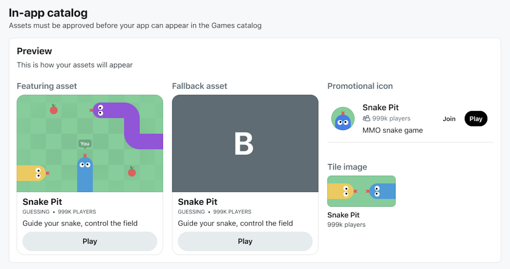
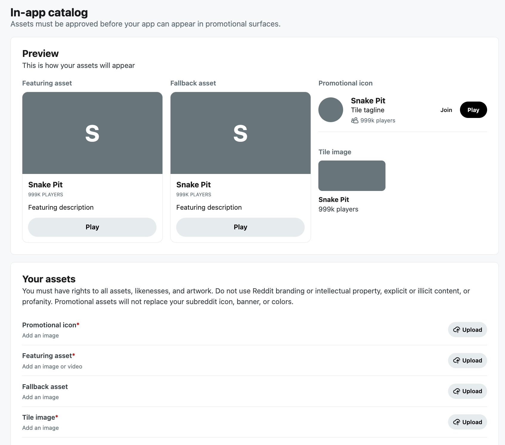

# In-app Catalog Assets

In-app catalog assets help redditors discover and understand your app across surfaces like the Games catalog, category-based browsing, and featured placements. They give users a consistent preview of your app and help them find apps that match their interests.

Approved in-app catalog assets are used for Reddit discovery and promotional placements where your app may appear. They do not replace your subreddit icon, banner, or colors.

:::info The in-app catalog editor is available for eligible apps when this feature is enabled. If you do not see the section in Developer Settings, your app may not have access yet. :::

## Best practices

You’ll want to use assets that provide an accurate and engaging sense of what users can expect from your app.

- Prioritize polished, representative art over generic branding.
- Animated assets should quickly communicate what the app is and consider ending with a splash screen.
- Make the first frame of a video meaningful in case autoplay is disabled.
- Avoid fast flashing, red strobe effects, and rapid full-screen color changes.
- Use enough contrast for important visual elements to remain distinguishable in grayscale.
- Keep text within images to a minimum. Smaller placements may crop or scale your assets.
- Choose the category that most accurately represents your app. An inaccurate category may cause your submission to be rejected.

## Manage your assets

Use the **In-app catalog** section in the Developer Portal to add your app and promotional assets, choose where users land from featured surfaces, and submit your changes for review.

### Open the in-app catalog editor

1. Go to the [Developer Portal](https://developers.reddit.com/).
2. Select your app.
3. Go to [Developer Settings](https://developers.reddit.com/apps/{your-app-slug}/developer-settings).
4. Locate the **In-app catalog** section.

Note: The editor includes a live preview so you can see how your assets and copy may appear as you configure them.

### Add your catalog assets

Under **Your assets**, add the images and copy used to represent your app across discovery and featured surfaces.

| Asset                     | Required                            | Description                                                                                                                                        |
| ------------------------- | ----------------------------------- | -------------------------------------------------------------------------------------------------------------------------------------------------- |
| **App icon**              | Yes                                 | Your app icon used in catalog and promotional placements.                                                                                          |
| **Featuring asset**       | Yes                                 | The main image or video used in larger featured placements.                                                                                        |
| **Fallback asset**        | When the featuring asset is a video | An image or animated GIF displayed when the featuring video cannot autoplay or is not supported. Ideally, use an asset that depicts app’s purpose. |
| **Tile image**            | Yes                                 | A compact image used in smaller tiles and placements.                                                                                              |
| **Featuring description** | Yes                                 | Short copy that appears alongside the featuring asset.                                                                                             |
| **Tile tagline**          | Yes                                 | A short tagline that appears alongside the app icon.                                                                                               |
| **Game category**         | Only if your app is a game.         | If your app is a game, select a category to help redditors find it.                                                                                |

All required fields must be complete before you can save your changes.

### Configure featured surfaces

You can control where redditors land when they engage with your app from supported featured surfaces. Start by selecting the subreddit users will visit, then optionally refine the posts that may be surfaced using the available post settings.

| Setting             | Required | Description                                                                 |
| ------------------- | -------- | --------------------------------------------------------------------------- |
| **App subreddit**   | Yes      | The subreddit where users go to engage with your app or view related posts. |
| **Post sort order** | No       | Controls how posts from the subreddit are surfaced. Defaults to **Hot**.    |
| **Post flairs**     | No       | Narrows the posts that may be surfaced based on flair.                      |

Choose a destination that gives players a useful next step after discovering your app. Prioritize high-quality, curated, or timely content so that the experience is relevant to the placement they came from.

**Note:** Adding post flairs is highly recommended because it gives you more control over what content may be surfaced. Do not include emojis when specifying flair.

## Submit your assets for review

Your assets must be [submitted](https://developers.reddit.com/docs/guides/launch/launch-guide#how-to-launch-an-app) and approved in [app review](https://developers.reddit.com/docs/devvit_rules#reddit-app-review) before your app can appear in the Games catalog or use the updated assets in eligible featured placements. Only the most recently approved set of assets is used.

To learn more about featuring opportunities and requirements, check out the [Feature Guide](https://chatgpt.com/c/feature-guide.mdx).
