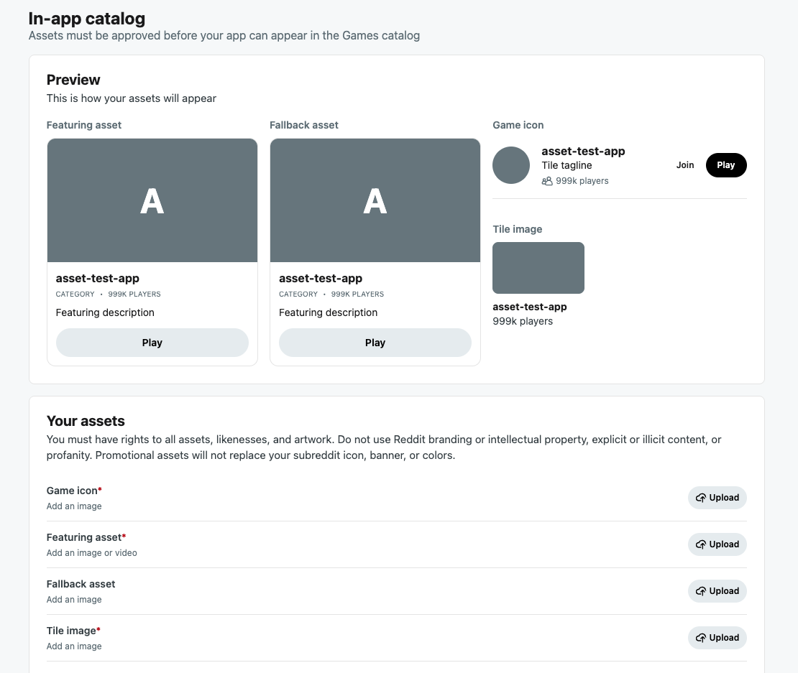

# Manage in-app catalog assets

In-app catalog assets help Reddit show your game in discovery surfaces such as the Games catalog and category-based game browsing. Use the **In-app catalog** section in the Developer Portal to upload your own game and promotional assets, configure where players should land, and submit the asset set for review.

Approved assets do not replace your subreddit icon, banner, or colors. They are used for Reddit discovery and promotional placements where your app may appear.

:::info
The In-app catalog editor is available for eligible game apps when this feature is enabled. If you do not see the section in Developer Settings, your app may not have access yet.
:::



The editor includes a live preview of your discovery assets and upload controls for each required media slot.

## Open the editor

1. Navigate to [Developer Portal](https://developers.reddit.com/).
2. Select your app.
3. Go to **Developer Settings**.
4. Find the **In-app catalog** section.

You can also open the page directly at:

```text
https://developers.reddit.com/apps/{your-app-slug}/developer-settings
```

## What you need

All required fields must be complete before you can save changes.

| Field | Required | Used for |
| --- | --- | --- |
| Game icon | Yes | The compact icon shown with your game. |
| Featuring asset | Yes | The large visual used in featured or promotional game units. |
| Fallback asset | Required only when the featuring asset is a video | The image or GIF shown when video cannot autoplay or is not supported. |
| Tile image | Yes | The smaller image used in game tiles. |
| Featuring description | Yes | Short text shown next to the featuring asset. |
| Tile tagline | Yes | Short text shown next to the game icon. |
| Game category | Yes | Helps category-based discovery and search. |
| Game subreddit | Yes | The subreddit where players should go to play or view posts. |
| Post sort order | No | Controls which posts are surfaced from the game subreddit. Defaults to **Hot**. |
| Post flairs | No | Helps narrow which posts may be surfaced. |

## Tips for better assets

- Make sure the first frame of a video communicates something meaningful in case autoplay is disabled.
- Avoid fast flashing, red strobe effects, and rapid full-screen color changes.
- Use enough contrast that logos and text remain readable in grayscale.
- Keep text inside images minimal; small game tiles may crop or scale the image.
- Prioritize polished, representative gameplay or game art over generic branding.

For broader featuring guidance, see [Get featured](./feature-guide.mdx).
