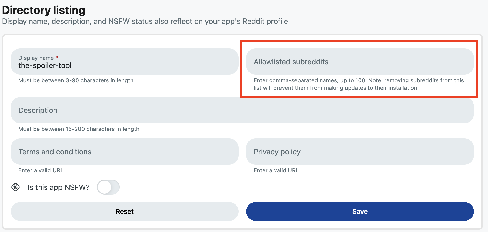

# Launch your app

Once your app is ready, you can launch it to users and moderators across Reddit. This guide outlines what “launch-ready” means and the steps you need to take to submit your app for review.

Polished apps may also apply for **Reddit featuring**, which includes on-platform promotion and distribution support. Make sure to read [this guide](https://developers.reddit.com/docs/guides/launch/feature-guide) before submitting your app.

---

:::warning
Our team pauses all app reviews during certain holiday periods each year. Please see community announcements in r/Devvit and Discord for specific limited support dates.
:::

## Is your app ready?

Apps should be polished and stable before launch. Ensure your data schema is scalable and your UIs are clean and accessible, as **quality and performance directly impact organic distribution and adoption**.

Before submitting your app for review, be sure to:

- Test all functionality across mobile and web.
- Test from multiple accounts (developer, moderator, regular user), since permissions differ.
- Have a stable prototype with clear UX flows.

We also recommend getting feedback from the community:

- **All apps:**
  - [Cross-post](https://support.reddithelp.com/hc/en-us/articles/4835584113684-What-is-Crossposting) your post to [r/Devvit](https://reddit.com/r/Devvit) using the **Feedback Friday** flair.
  - Share your app in the **#ideas-and-feedback** channel in the Reddit Devs Discord.
- **Games:**
  - Cross-post gameplay posts to [r/GamesOnReddit](https://reddit.com/r/GamesOnReddit) with the **Feedback** flair.
- **Mod Apps:**
  - Share your app in the **#mod-chat** Discord channel for moderator-specific feedback.

If your app is a **game**, ensure the experience:

- Works across platforms with responsive design.
- Includes a custom launch or first screen.
- Avoids inline scrolling (scrolling inside inline webviews is prohibited).
- Has a dedicated, non-test subreddit (e.g., [r/Pixelary](https://www.reddit.com/r/Pixelary/)).
- Is immediately understandable to new users.

Launching your app signals to Reddit’s algorithmic feeds that it is ready for broader distribution. Engagement — clicks, dwell time, and voting — determines your organic reach.

---

## How to launch an app

Apps are submitted for review through the CLI. To launch your app:

1. Add the required app [`README.md`](../../devvit_rules.md#app-readme-requirements).
2. Run `npx devvit publish`.

   You can optionally choose the version bump type with `--bump`:

   - `npx devvit publish --bump major`
   - `npx devvit publish --bump minor`
   - `npx devvit publish --bump patch` (default)

   `--bump` accepts only `major`, `minor`, or `patch`, and cannot be used with `--version`.

   If you prefer to set a specific version directly, use `--version`:

- `npx devvit publish --version 1.0.1`

  `--version` must be a stable version (for example, `1.0.1`), prerelease versions are not allowed, and it cannot be used with `--bump`.

Once submitted, your app enters Reddit’s review queue. Our team evaluates your code, example posts, and app documentation.

You will receive email confirmation when your app is approved. If we need more information, a team member may contact you via Modmail or Reddit chat.

Because you must run `npx devvit publish` for **every version** you want to launch, we recommend batching updates into weekly (or less frequent) releases.

Review times vary. We aim to review most apps — especially version updates — within **1–2 business days**. New apps, apps with policy ambiguity, or apps using higher-risk features (e.g., payments, fetch) may require more time.  
If you haven’t heard from us after a week, please reach out in Discord or via [r/Devvit Modmail](https://www.reddit.com/message/compose/?to=r/Devvit).

Ensuring your app complies with all [Devvit Rules](https://developers.reddit.com/docs/devvit_rules) will streamline review.

**By default, published apps are unlisted**, meaning other communities cannot install them. This is ideal for games and community-specific tools.

---

## List your app for any community to install

If your app is a general-purpose moderation tool, community utility, or otherwise broadly applicable, you can request to list it in the [App Directory](https://developers.reddit.com/apps). Listing makes your app installable by any moderator.

All apps submitted for review must include an app [`README.md`](../../devvit_rules.md#app-readme-requirements).

To list your app:

1. Run `npx devvit publish --public`
2. Once approved, it will appear in the Apps Directory for any community to install.

We do not recommend listing apps built for a single subreddit, as this may confuse moderators and clutter the directory.

---

## Share an unlisted app with selected communities

Public Limited mode lets you make unlisted versions of your app available to a specific set of subreddits without publishing the app in the public app directory.

When this mode is enabled for your app, you can add up to 100 subreddits to an allowlist. Moderators of those communities can then install an approved unlisted version themselves from a direct link to the app’s details page.

:::note

This feature is currently opt-in only. You can request access through [r/Devvit](https://www.reddit.com/r/Devvit/) modmail.

:::

### How it works

For apps with Public Limited mode enabled:

1. Open your app’s settings in the Developer Portal.
2. Add the subreddit names that should be allowed to install the app.
3. Save your changes.
4. Share a direct link to the app’s details page with the moderators of those communities.

A moderator must have full (“Everything”) permissions in an allowlisted subreddit to install the app.

Unlisted versions made available this way are subject to the same review requirements as public versions. However, the app remains hidden from the public app directory and can only be installed in the communities you specify.

### Version visibility

Public Limited mode changes only how unlisted versions behave:

- **Unlisted versions** can be installed in allowlisted subreddits.
- **Public versions** can still be discovered and installed in any eligible subreddit.
- **Private versions and playtests** are unaffected.

For eligible moderators, accessible unlisted versions are also included when determining the latest version of the app in the Developer Portal, CLI, and app details page.

### Changing the allowlist

Adding a subreddit allows its moderators to install eligible unlisted versions of the app.

Removing a subreddit does not uninstall the app or interrupt its current operation. However, an installation in that subreddit cannot update to a later unlisted version unless the subreddit is added to the allowlist again.

The installation can still update to a future public version of the app.

> **Important:** Changes to the allowlist never remove or disable an existing installation. They affect only new installations and updates to unlisted versions.

### Availability

Public Limited mode is available for eligible apps. If the setting is available for your app, the subreddit allowlist appears in its Developer Portal settings.

## Resources

- Questions? Join our Discord or post in [r/Devvit](https://www.reddit.com/r/Devvit/).
- Review the [Devvit Rules](https://developers.reddit.com/docs/devvit_rules) before publishing.
- Learn more about [how to earn](../../earn-money/payments/payments_overview.md) from your apps.
